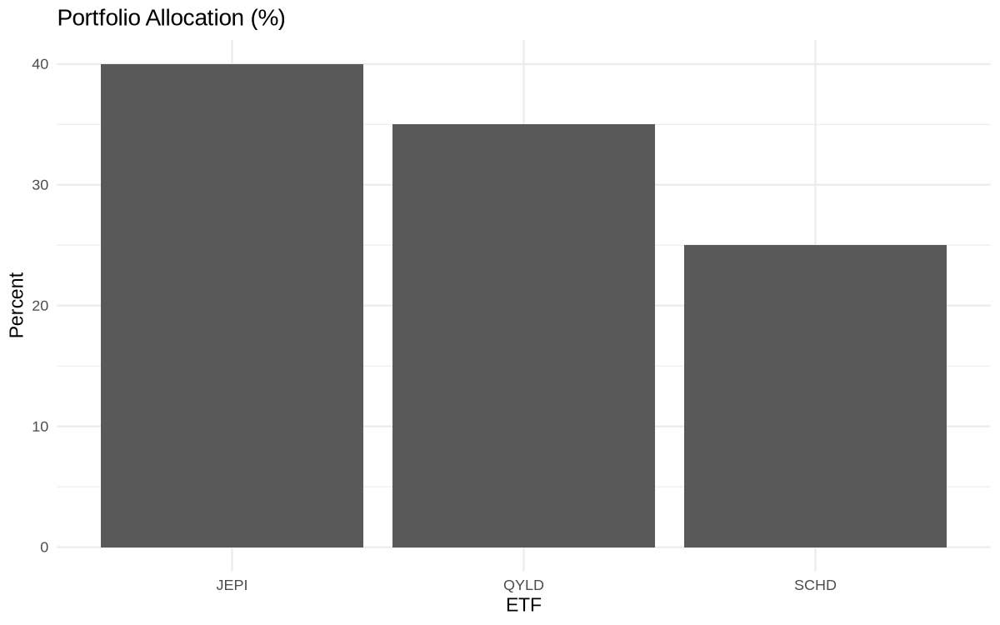
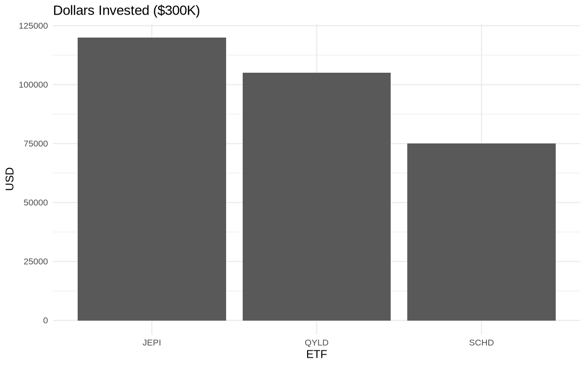
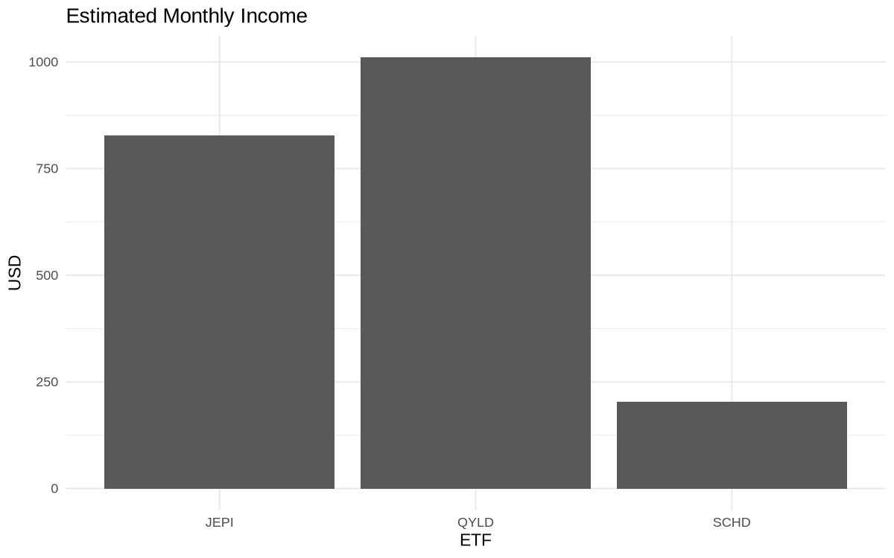
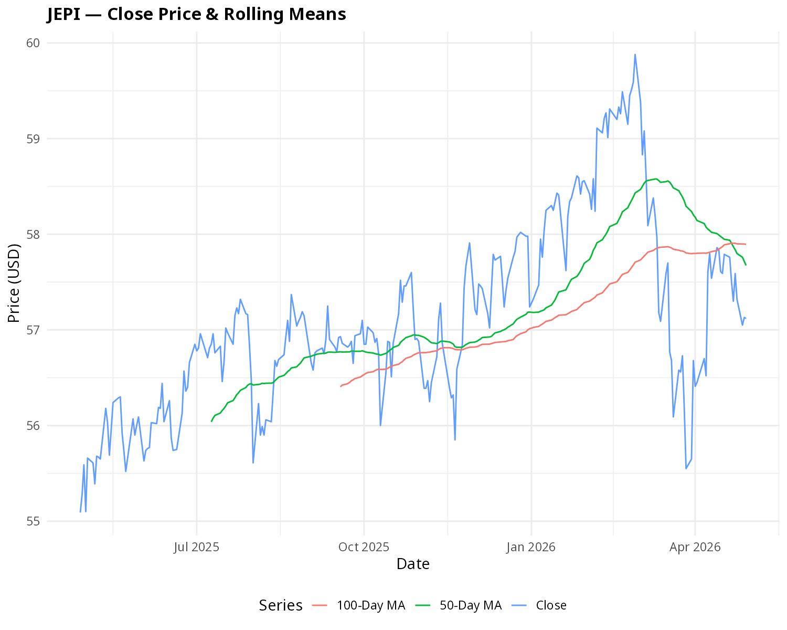
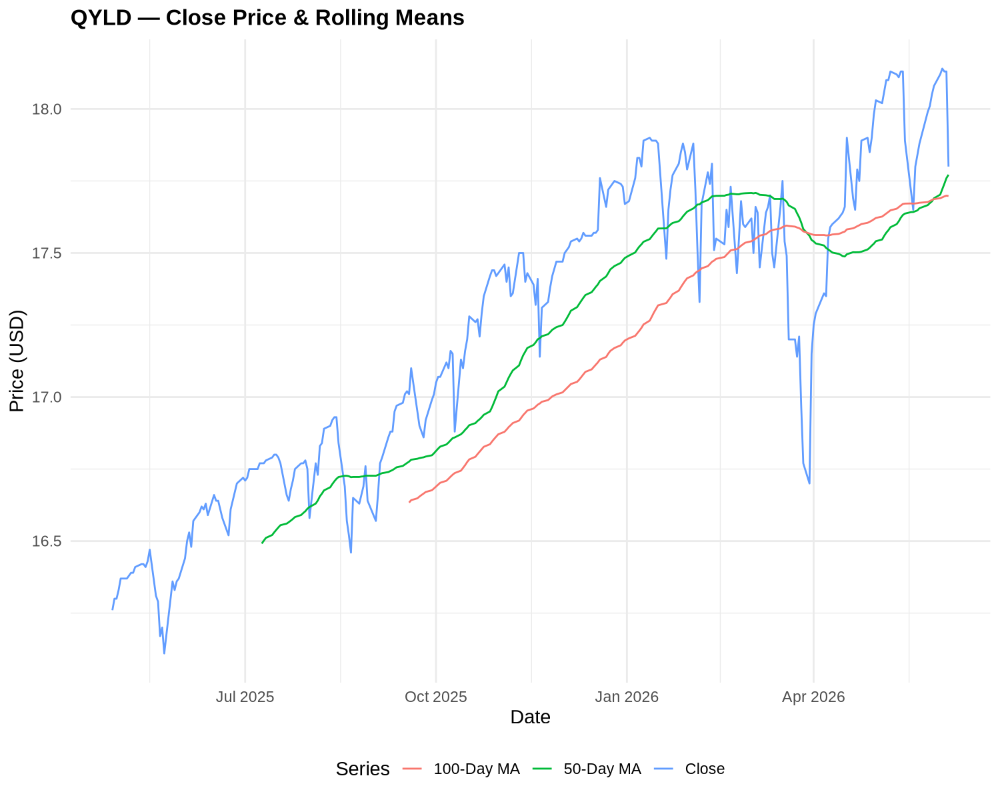
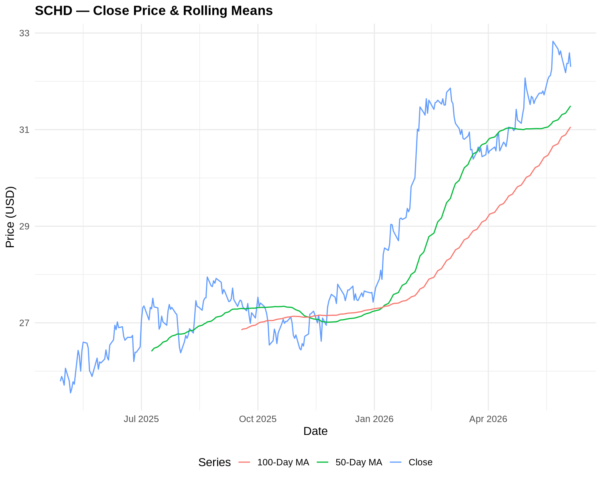
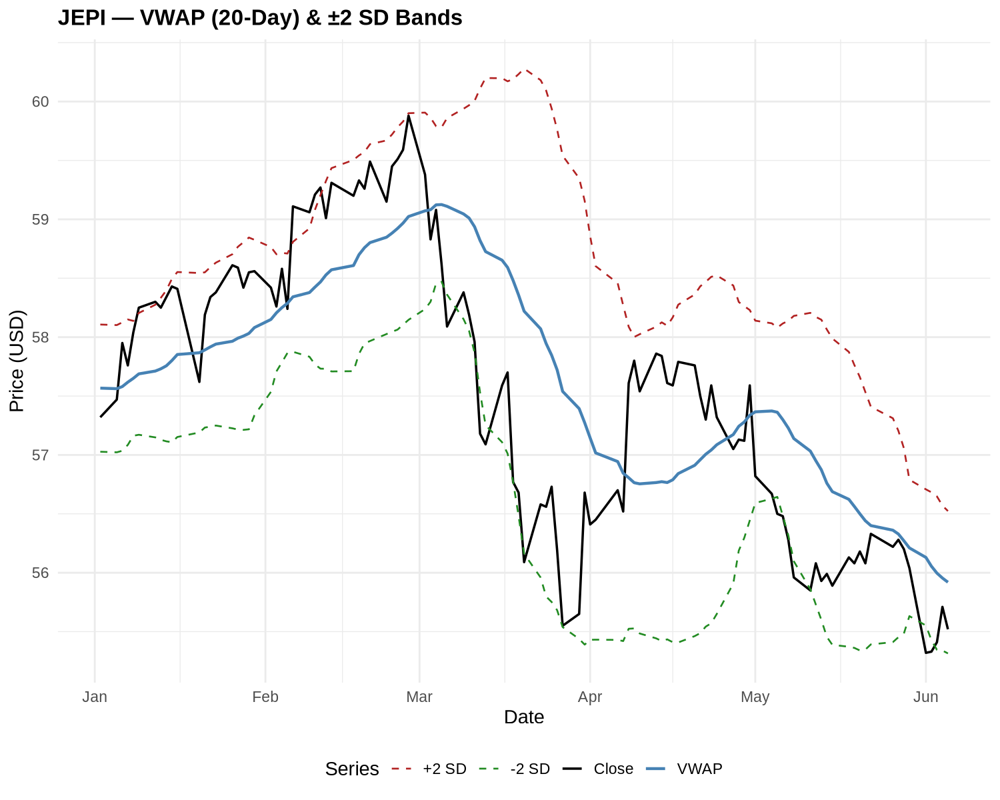
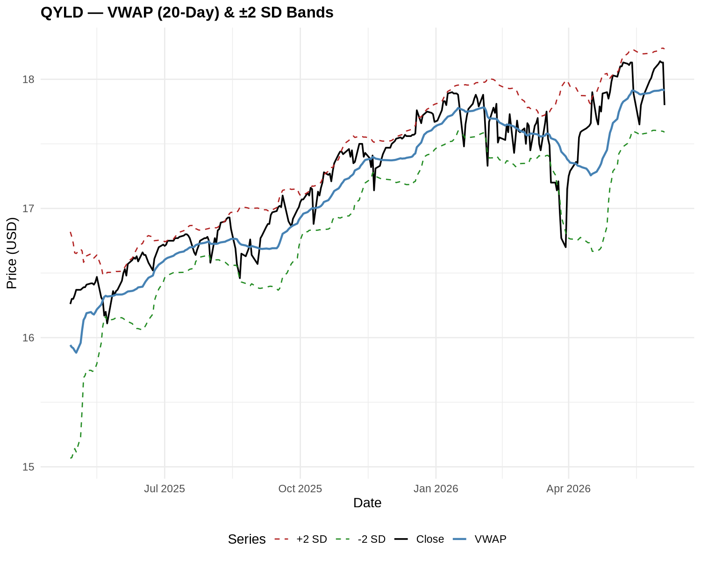
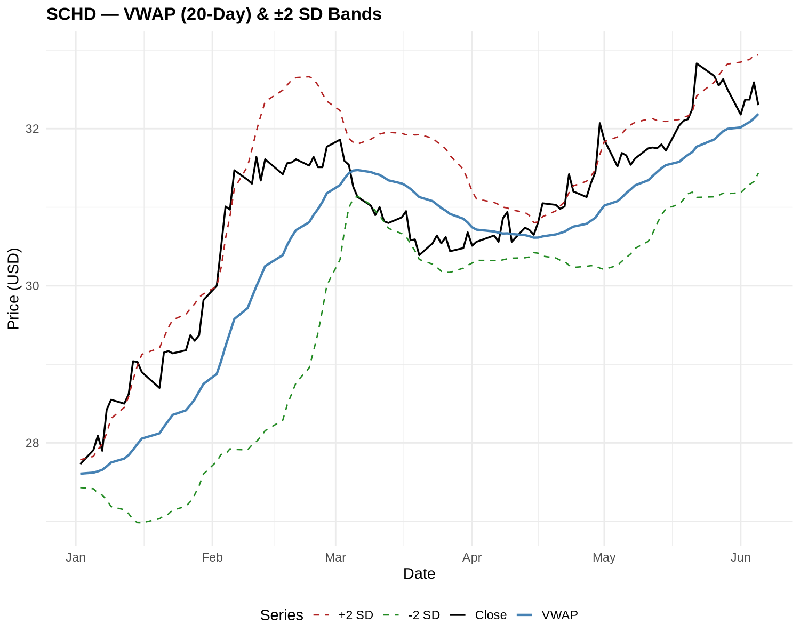

# Income ETF Analysis

R project for tracking, analyzing, and estimating dividend income from a three-ETF portfolio stored in a local DuckDB database.

## Portfolio

| Ticker | Fund | Allocation |
|--------|------|-----------|
| JEPI | JPMorgan Equity Premium Income ETF | 40% |
| QYLD | Global X NASDAQ 100 Covered Call ETF | 35% |
| SCHD | Schwab U.S. Dividend Equity ETF | 25% |

## Project Structure

```
finance_r/
├── grab_stock_data.R              # Fetch OHLCV data and populate database
├── income_analysis.R              # Price analysis, VWAP bands, plot generation
├── income_eatimates.qmd           # Equal-weighted income estimate report
├── income_eatimates_percents.qmd  # Allocation-weighted income estimate report
├── investment.duckdb              # Local DuckDB database
└── *.png                          # Generated plot images
```

## Scripts

### `grab_stock_data.R`
Pulls 5 years of daily OHLCV data for all three tickers from Yahoo Finance via `quantmod` and writes it to the `income` table in `investment.duckdb`.

```r
Rscript grab_stock_data.R
```

**Columns stored:** `Date`, `Ticker`, `Open`, `High`, `Low`, `Close`, `Volume`, `Adjusted`

### `income_analysis.R`
Loads the full `income` table, computes technical indicators, writes the enriched data back to the database, then generates plots.

```r
Rscript income_analysis.R
```

**Adds to database:**

| Column | Description |
|--------|-------------|
| `VWAP` | 20-day rolling Volume-Weighted Average Price using Typical Price `(H+L+C)/3` |
| `VWAP_sd` | 20-day rolling standard deviation of Typical Price |
| `VWAP_upper` | VWAP + 2 × SD |
| `VWAP_lower` | VWAP − 2 × SD |

**Generated plots** (filtered to data from 2025-04-28 onward):

| File | Contents |
|------|----------|
| `jepi_plot.png` | JEPI Close + 50-day & 100-day rolling means |
| `qyld_plot.png` | QYLD Close + 50-day & 100-day rolling means |
| `schd_plot.png` | SCHD Close + 50-day & 100-day rolling means |
| `jepi_vwap.png` | JEPI Close, VWAP, +2 SD, −2 SD bands |
| `qyld_vwap.png` | QYLD Close, VWAP, +2 SD, −2 SD bands |
| `schd_vwap.png` | SCHD Close, VWAP, +2 SD, −2 SD bands |

### `income_eatimates.qmd`
Quarto report estimating dividend income for a **$150,000 equal-weighted** portfolio. Fetches live prices and trailing 12-month dividends via `tidyquant`.

```bash
quarto render income_eatimates.qmd
```

### `income_eatimates_percents.qmd`
Quarto report estimating dividend income for a **$300,000 allocation-weighted** portfolio (40/35/25 split). Includes bar charts for allocation, invested dollars, annual income, and monthly income.

```bash
quarto render income_eatimates_percents.qmd
```

## Dependencies

| Package | Purpose |
|---------|---------|
| `quantmod` | Yahoo Finance data fetch |
| `tidyquant` | Live prices and dividend history (Quarto reports) |
| `tidyverse` | Data wrangling and plotting |
| `dplyr` | Data manipulation |
| `ggplot2` | Charting |
| `zoo` | Rolling mean / rolling apply |
| `DBI` / `duckdb` | Database connection |
| `lubridate` | Date arithmetic |

Install all at once:

```r
install.packages(c("quantmod", "tidyquant", "tidyverse", "dplyr",
                   "ggplot2", "zoo", "DBI", "duckdb", "lubridate"))
```

## Income Estimates ($300K Portfolio, 40/35/25 Allocation)

### Portfolio Allocation


### Dollars Invested


### Estimated Annual Income


### Estimated Monthly Income


## Rolling Mean Plots (2025-04-28 onward)

### JEPI


### QYLD


### SCHD


## VWAP Plots (2026-01-01 onward)

### JEPI


### QYLD


### SCHD


## Typical Workflow

```
1. Rscript grab_stock_data.R          # refresh database with latest prices
2. Rscript income_analysis.R          # recompute VWAP bands, regenerate plots
3. quarto render income_eatimates_percents.qmd   # update income estimate report
```
